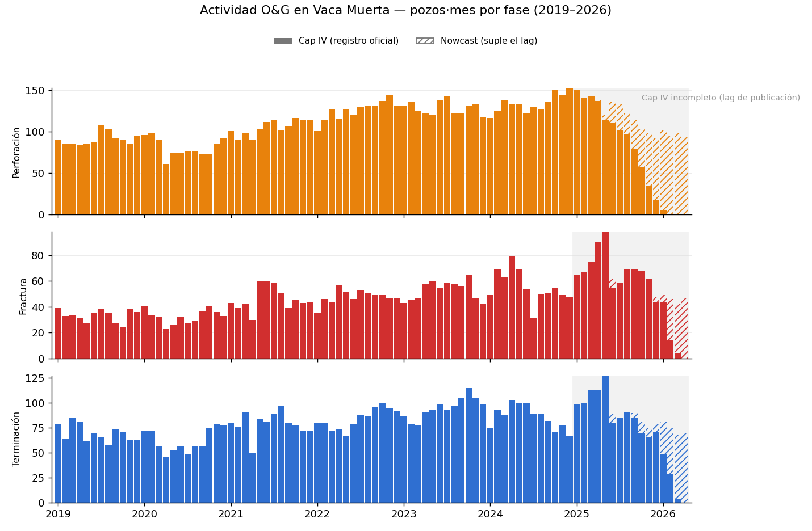

# Actividad en Vaca Muerta vista desde el espacio (de noche)

¿Se puede ver **dónde y cuándo** se perfora, fractura y produce en Vaca Muerta mirando la **huella
lumínica nocturna** de los satélites? Las perforadoras y los *frac spreads* trabajan iluminados de
noche, y la producción suele **quemar gas (flaring)**. Cruzando esa luz (VIIRS) con el **ciclo de vida
público de cada pozo** (fechas de perforación/terminación del Cap IV + fractura del Adjunto IV) y las
**concesiones**, se etiqueta **qué actividad hay, dónde y de qué operador** — todo con datos públicos.

## Mapa interactivo (mes a mes)

Arrastrá el slider o tocá ▶. Color = tipo de actividad; **anillo** = confirmado por luz nocturna. El
panel izquierdo rankea los **operadores con más perforación/fractura/terminación** ese mes.

<iframe src="assets/demo_actividad.html" width="100%" height="640" style="border:1px solid #ccc;border-radius:6px"></iframe>

## La actividad en el tiempo

El Cap IV se publica con **~13,5 meses de lag**, así que los últimos meses están incompletos y la
actividad *parece* desplomarse. El **relleno sólido** es el registro oficial; el **rayado** es el
**nowcast** estimando lo que el satélite ya ve pero el Cap IV todavía no reportó (zona gris). No es que
se dejó de perforar: es dato que falta publicar.

{ loading=lazy }

## ¿Funciona? Validación contra el ground-truth

Cruzando **21.950 detecciones nocturnas** (NASA Black Marble, VIIRS ~500 m) con **20.178 eventos de
pozo** (radio 1200 m, mismo mes):

| Métrica | Valor |
|---|---|
| Eventos confirmados por luz nocturna | **71 %** |
| Recall **Fractura** | **79 %** |
| Recall **Terminación** | **70 %** |
| Recall **Perforación** | **68 %** |
| Precisión (luz sobre evento transitorio) | 16 % |

**La luz nocturna detecta ~7 de cada 10 operaciones conocidas.** La precisión baja es esperable: la
mayoría de las luces son **producción/flaring de pozos en marcha, facilidades y pueblos**, no eventos
nuevos. Operadores más activos: **YPF, Shell, Vista, Pluspetrol, Tecpetrol, PAE**.

## Nowcast: adelantar el dato oficial

El Cap IV se publica con **~13,5 meses de atraso** (mediana), pero el satélite ve la actividad al
instante. Un modelo (*gradient boosting* sobre la señal nocturna, **validado fuera de muestra**) predice
la perforación/fractura del mes con **ROC-AUC 0.85 (perf) y 0.91 (fractura)**. La capa **Nowcast**
(magenta, punteada) marca los pozos con alta probabilidad de actividad **antes** de que aparezca en el
registro oficial. Detalle en [Método y validación](metodo.md).

!!! note "Cómo leer el mapa"
    - **Perforación / Fractura / Terminación**: eventos *transitorios* (la actividad "nueva").
    - **Flaring / Producción**: estado estable de pozos ya terminados (luz nocturna cerca del pozo;
      muy brillante ⇒ flaring).
    - **Pueblo/ciudad**: luces persistentes sin pozos cerca (Añelo, Neuquén, Cutral-Có…), excluidas de
      la actividad O&G.

*Datos 100 % públicos. Ver [Método y validación](metodo.md).*
