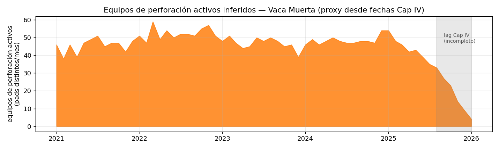

# Método y validación

Pipeline 100 % reproducible con datos públicos/gratuitos. Derivado del trabajo InSAR de subsidencia.

## Fuentes

- **Luz nocturna:** NASA **Black Marble VNP46A3** (VIIRS DNB mensual, *gap-filled*, ~500 m), vía
  Earthdata (`earthaccess` + `~/.netrc`). Captura luces de equipos **y** flares como radiancia.
  *(EOG VIIRS Nightfire sería ideal para separar flaring por temperatura, pero su autenticación migró a
  un flujo no automatizable; quedó como alternativa deprecada.)*
- **Pozos:** Capítulo IV (Secretaría de Energía) — coordenadas + **fechas de perforación y terminación**.
- **Fractura:** Adjunto IV — **fechas de fractura**, agua y arena.
- **Concesiones:** polígonos con operador por bloque.

## Pasos

1. `data/fetch_wells.py` — pozos del AOI con su ciclo de vida (18.942 pozos; 3.655 fracturas).
2. `data/fetch_blackmarble.py` — descarga + mosaico + recorte de VNP46A3 → un raster mensual de
   radiancia nocturna (88 meses, 2019–2026).
3. `detect.py` — umbral por anomalía sobre el fondo rural → **detecciones puntuales** mensuales (21.950).
4. `label.py` — reglas espacio-temporales:
   - detección en la **ventana** de perforación/fractura/terminación de un pozo cercano → ese evento,
     **confirmado por satélite**;
   - detección cerca de un pozo ya **terminado** → **Flaring** (muy brillante) o **Producción**;
   - luz **persistente sin pozos** cerca → **Pueblo/ciudad** (excluida).
5. `validate.py` — *recall* y *precisión* de la luz nocturna contra los eventos conocidos.
6. `viz.py` — el dashboard (mapa + slider + ranking por operador).

## Detección mejorada (VNF) y nowcasting

**VIIRS Nightfire (VNF).** Además del DNB (luces), sumamos el survey anual de flares de EOG (combustión
por temperatura SWIR + volumen BCM). La capa **Flaring** pasa de un proxy por brillo a **combustión
real** atribuida por operador. Subió el recall de los eventos (FRAC 79→82 %, PERF 68→71 %, TERM 70→74 %).

**Nowcasting — adelantar el Cap IV.** El dato oficial llega con **lag mediano de ~13,5 meses**
(`analysis/lag.py`); el satélite lo ve al instante. Entrenamos un *gradient boosting*
(`features.py` → tabla pozo×mes con DNB + **change-detection** vs línea de base, VNF, persistencia,
vecindad, operador; `nowcast.py`) con **holdout temporal** (entrena ≤2023, testea 2024-2026):

| Objetivo | ROC-AUC (holdout) | PR-AUC | tasa base |
|---|---|---|---|
| **Perforación** | **0.85** | 0.33 | 0.033 |
| **Fractura** | **0.91** | 0.22 | 0.018 |

ROC-AUC 0.85–0.91 fuera de muestra = **skill predictivo real**; PR-AUC ~10–12× la tasa base (lift fuerte
pese al desbalance), mejorando la precisión del baseline de regla. La capa **Nowcast** del dashboard
marca, para el último mes, los pozos con probabilidad alta de perf/fractura **antes** de que el Cap IV
los publique.

### Fallback por frescura (cascade de tiers)

El nowcast más fresco (2025-26) es el más valioso pero el que **menos features** tiene: el survey **VNF
es anual y no existe aún para esos años**. Para no degradarse en silencio, hay dos modelos y cada mes usa
el más alto disponible: **T1** (con VNF, ≈≤2024) y **T2** (sin VNF, 2025-26). El costo de perder el dato
anual es **mínimo**:

| Objetivo | T1 (con VNF) | T2 (sin VNF) | costo frescura |
|---|---|---|---|
| Perforación | ROC-AUC 0.853 | 0.849 | −0.004 |
| Fractura | ROC-AUC 0.911 | 0.906 | −0.005 |

Es decir: la señal la llevan el **DNB + change-detection + historia**, no el VNF — así que el nowcasting
de los meses frescos (donde el Cap IV está casi vacío y el VNF todavía no salió) **se mantiene fuerte**.
En el mapa, el anillo de predicción se dibuja más tenue/punteado cuando es tier T2 (sin VNF).

### Terminación, volumen calibrado y equipos

**Terminación** se suma como tercer objetivo del nowcaster (ROC-AUC **0.92** en holdout, junto a
perforación 0.87 y fractura 0.92).

**Volumen consistente con el histórico.** Las probabilidades se **calibran (isotónica)** para que su
suma ≈ el conteo real, y el nowcast marca **top-K = volumen esperado** → la predicción no sobre/sub-cuenta
(Σpred/Σreal en holdout: perf **1.09**, frac 1.23, term 1.44; antes 11-19×). El ancla de volumen es el
propio conteo del Cap IV (los labels son el registro oficial).

**Equipos (sin ID de rig público → cantidad/movimiento/tamaño, no identidad).**
- *Tracking*: nº de equipos de perforación activos = pads distintos con perforación por mes. Da una
  **mediana ~47 rigs/mes** en Vaca Muerta (orden del rango conocido ~30-45 → sanity). El desplome de los
  últimos meses es el **lag del Cap IV**, no caída real — lo que el nowcast corrige.

  { loading=lazy }
- *Tamaño por intensidad*: la firma nocturna correlaciona **positivo pero débil** con la potencia del set
  de fractura (Spearman HP↔brillo ρ=+0.12, p=3e-8) — a 500 m no alcanza para dimensionar el set con
  precisión, pero la señal existe.

## Caveats

- **Resolución VIIRS ~500 m** → actividad a nivel **pad-cluster**, no por-pad; en el core denso de Añelo
  se funden pads vecinos.
- **Sin separación física flaring/luces** (no usamos VNF por temperatura): el split Flaring/Producción es
  un **proxy por brillo**.
- **Muestreo mensual**: fracturas cortas (días) pueden perderse; la perforación (semanas) es más
  detectable — por eso el *recall* de fractura/terminación es algo mayor.
- **Atribución, no causalidad.** Hay operaciones no detectables (sin flare, breves, nubladas) y luces no
  productivas (caminos, plantas).

## Reproducir

```bash
M="mamba run -n insar python"
$M data/fetch_wells.py && $M data/fetch_blackmarble.py && $M data/fetch_vnf.py
$M detect.py && $M label.py && $M validate.py
$M analysis/lag.py && $M features.py && $M nowcast.py   # nowcasting (scorea toda la cola laggeada)
$M analysis/timeline.py   # chart oficial + nowcast supliendo el lag
$M viz.py
```

Código: [github.com/mpodeley/vaca-muerta-nightlights](https://github.com/mpodeley/vaca-muerta-nightlights).
